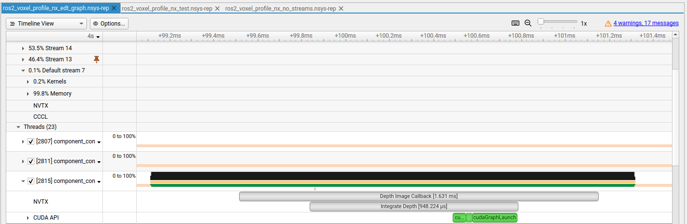
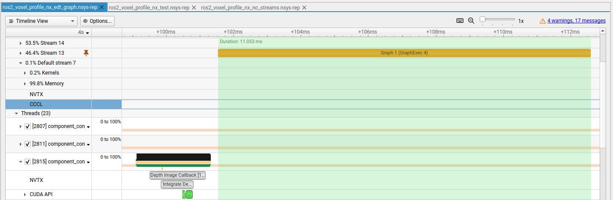
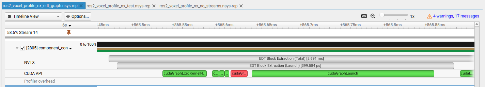
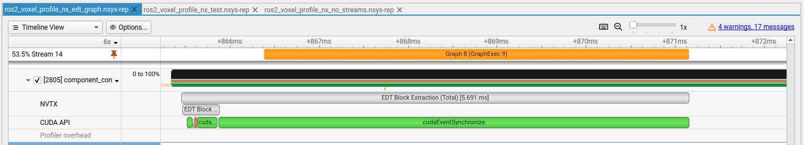

# CUDA Voxel Mapping
Voxel Mapping is a CUDA-accelerated library for generating 3D environment representations for navigation and collision avoidance.


This package uses a device side hash map for sparse mapping of pre allocated voxel-chunks. The API functions are available in `include/voxel_mapping.hpp` and custum types are defined in `include/types.hpp`


# Key Features

- **Fully CUDA-Accelerated:** All core operation like map-insertion, distance field calculation, and data extraction are executed entirely on the GPU.
- **Sparse Chunk Mapping:** Uses a device-side hash map (`cuCollections::static_map`) for chunk based spatial hashing.
- **On-the-Fly Distance Fields:** Generates Euclidean Distance Transforms (EDT) using optimized CUDA kernels for fast collision checking.
- **Flexible Data Extraction:** Supports highly efficient extraction of both full 3D blocks and multiple non-contiguous 2D slices.
- **Raycasting Kernel for Sensor Updates:** Integrates a fast, parallelized raycasting kernel to efficiently update the voxel map with new sensor data, enabling real-time integration of depth measurements.

# Dependencies

The `voxel_mapping` package internally depends on **cuCollections** (a GPU-accelerated concurrent data structures library) and **CCCL** (CUDA C++ Core Libraries). Due to these dependencies, `voxel_mapping` and any package that uses it inherit specific system requirements.

When building `voxel_mapping` or any package that links against it, ensure your development environment meets **all** of the following minimum requirements:

- **NVCC (NVIDIA CUDA Compiler):** 12.0 or newer  
- **C++ Standard:** C++17  
- **GPU Architecture:** Volta (Compute Capability 7.0) or newer  

# Using the `voxel_mapping` Library in a ROS 2 Package

This guide explains how to include and link against the `voxel_mapping` CUDA library in another ROS 2 package within the same workspace.

## Prerequisites

Ensure that the `voxel_mapping` library and your new ROS 2 package are both located in the `src` folder of the same ROS 2 workspace.

## Step 1: Add Package Dependency

First, you must declare a dependency on the `voxel_mapping` package. This ensures `colcon` builds it before your package.

In the `package.xml` of your ROS 2 package, add the following line:

```xml
<depend>voxel_mapping</depend>
````

## Step 2: Update CMakeLists.txt

Next, modify your package's `CMakeLists.txt` to find and link the library.

### 1\. Find Required Packages

You need to find three key packages:

1.  `ament_cmake`: The standard ROS 2 build system.
2.  `CUDAToolkit`: **This is essential.** Because `voxel_mapping` has a public dependency on CUDA, any package that uses it must also find the CUDA toolkit.
3.  `voxel_mapping`: Your custom library.

Add these lines near the top of your `CMakeLists.txt`:

```cmake
find_package(ament_cmake REQUIRED)
find_package(CUDAToolkit REQUIRED)
find_package(voxel_mapping REQUIRED)
```

### 2\. Link the Library

Now, link your target (e.g., your component library or executable) against the `voxel_mapping::voxel_mapping` target.

```cmake
# Example target
add_library(my_component SHARED src/my_component.cpp)

# Link against voxel_mapping
target_link_libraries(my_component PUBLIC
  voxel_mapping::voxel_mapping
)
```

### 3\. Add to Ament Dependencies

Finally, make sure `voxel_mapping` is listed in your `ament_target_dependencies`.

```cmake
ament_target_dependencies(my_component PUBLIC
  rclcpp
  # ... other dependencies
  voxel_mapping
)
```

## Step 3: Build the Workspace

With the dependencies declared, you can now build your workspace from the root directory (e.g., `~/ros2_ws`):

```bash
colcon build --symlink-install
```

Colcon will automatically build `voxel_mapping` first, followed by your package, correctly linking them together.

# Profiling

The library is now highly optimized with CUDA graphs for asynchronous execution. The first image shows the host time for a map insertion with a max depth set to 10 m and resolution of 0.1 m, meaning this queries the raycasting and updates the relevant axis-aligned bounding box. The image shows that the host wait time to queue up an insertion is less than 1 ms.



After the host regains control, the device handles the asynchronous execution of the insertion graph in parallel while the host performs other tasks. The execution step of the graph can take around 11 ms.



This highlights the benefit of using CUDA graphs, where the computations are performed asynchronously so the host does not have to stand idle waiting for the expensive operations to complete.

The host can also, in parallel, perform extractions from a desired 3D section of the voxel map. This operation is also split into two parts: a graph launch and an execution stage. This shows a CUDA graph launch time of 400 microseconds.




The specified 3D section is then extracted from the map and a 3D Euclidean distance transform is performed in that space. This graph execution phase happens asynchronously on the device, freeing the host to perform other tasks while waiting for the result.



All CUDA graphs are supported by pinned, page-locked host memory for minimum latency.